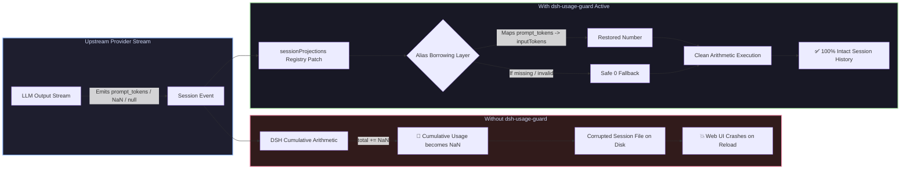

# 📦 @goodandready/dsh-usage-guard

<div align="center">

<h3>Session Token-Usage Sanitizer, History Crash Guard & Arithmetic Protection for DeepSeek Harness</h3>

<p align="center">
  <a href="https://www.npmjs.com/package/@goodandready/dsh-usage-guard"></a>
  <a href="LICENSE"></a>
  <a href="https://github.com/topics/dsh-plugin"></a>
  <a href="https://nodejs.org"></a>
</p>

<p align="center">
  <a href="README.md"><b>🇬🇧 English</b></a> •
  <a href="README.ru.md"><b>🇷🇺 Русский</b></a> •
  <a href="README.zh.md"><b>🇨🇳 中文说明</b></a>
</p>

</div>

---

## ⚡ The Problem: How Upstream Providers Poison Session History

In **DeepSeek Harness**, session projections aggregate cumulative token usage across four core buckets:
* `inputTokens`
* `outputTokens`
* `cacheReadTokens`
* `cacheWriteTokens`

The core harness assumes that upstream providers will always return valid finite numbers for `inputTokens` and `outputTokens`. 

However, non-standard upstream providers, local inference engines (vLLM, Ollama), third-party gateways, and community routers frequently emit malformed usage objects:
* **Alternative field names**: `prompt_tokens`, `promptTokens`, `input`, `completion_tokens`, `output`, `cached_tokens`;
* **Missing or null fields**: `undefined`, `null`;
* **Non-finite numbers**: `NaN`, `Infinity`, or string numbers.

When standard DSH performs accumulation (`total += usage.inputTokens`), adding `NaN` or `undefined` instantly poisons the cumulative total into `NaN`. Once written to disk, **the entire conversation session becomes unreadable and crashes the Web UI upon reload**.



---

## 🛡️ Multi-Tier Healing Architecture

`dsh-usage-guard` intercepts `sessionProjections` events before cumulative addition and repairs usage payloads non-destructively:

### 1. Alias Borrowing (`borrowed`)
Before defaulting to zero, the guard searches common provider alias dictionaries:
* **`inputTokens`** ← `prompt_tokens`, `promptTokens`, `input`
* **`outputTokens`** ← `completion_tokens`, `completionTokens`, `output`
* **`cacheReadTokens`** ← `cache_read_tokens`, `cachedTokens`, `cached_tokens`, `cache_read_input_tokens`
* **`cacheWriteTokens`** ← `cache_write_tokens`, `cacheCreationTokens`, `cache_creation_input_tokens`

### 2. Finite Number Validation (`sound`)
Verifies `typeof value === 'number' && Number.isFinite(value)` to reject `NaN`, `Infinity`, and malformed strings.

### 3. Safe Zero Fallback (`repaired`)
If a required metric cannot be recovered via aliases, it is safely initialized to `0`. While an approximate metric, it completely prevents arithmetic poisoning and guarantees session durability.

### 4. Diagnostic Logging (`complaint`)
When a damaged usage object is sanitized, the plugin logs the exact turn, step, original payload, and whether fields were mapped via aliases or zeroed.

---

## 🔌 In-Memory Projection Hook (`lib/patch.js`)

The plugin patches the `sessionProjections` registry in-memory:
* **Pre-existing Projections**: Wraps all existing `.apply` projection handlers currently active in the service.
* **Late-Binding Projections**: Traps future projection registrations via `map.set` wrapping, ensuring 100% coverage regardless of plugin load order.
* **Zero Overhead**: Uses shallow event cloning only along the usage path, preserving all other event references intact.

---

## 📦 Quick Installation

```bash
dsh plugin --profile web add @goodandready/dsh-usage-guard
```

> [!IMPORTANT]
> Restart DSH after installation (`systemctl --user restart dsh-web`) to activate projection protection.

---

## 📄 License

MIT © [GooDAnDReaDY](https://github.com/GooDAnDReaDY)
