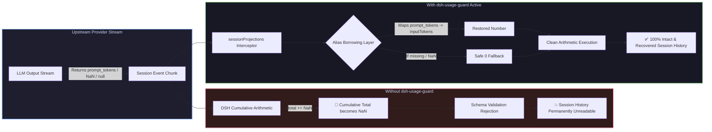

# 📦 @goodandready/dsh-usage-guard

<div align="center">

<h3>Session Token-Usage Sanitizer, History Crash Guard & Arithmetic Protection for DeepSeek Harness</h3>

<p align="center">
  <a href="https://www.npmjs.com/package/@goodandready/dsh-usage-guard"></a>
  <a href="LICENSE"></a>
  <a href="https://github.com/topics/dsh-plugin"></a>
  <a href="https://nodejs.org"></a>
</p>

<p align="center">
  <a href="https://goodandready.app/"></a>
</p>

<p align="center">
  <a href="README.md"><b>🇬🇧 English</b></a> •
  <a href="README.ru.md"><b>🇷🇺 Русский</b></a> •
  <a href="README.zh.md"><b>🇨🇳 中文说明</b></a>
</p>

<table align="center">
  <tr>
    <td align="center">
      ⭐ <strong>If you like this plugin, please star it on GitHub</strong> — it shows me that the plugin is useful to you and motivates me to keep developing it.
      <br><br>
      🐛 <strong>If you find a bug or would like to request a feature</strong>, open a GitHub issue in any language — I will review your proposal and implement useful suggestions in a future plugin version.
    </td>
  </tr>
</table>

</div>

---

## ⚡ The Root Problem: How Upstream Providers Poison Session History

In **DeepSeek Harness**, session projections aggregate cumulative token usage across four core buckets:

```javascript
uncachedInputTokens: usage.inputTokens,        // No safety fallback in DSH core!
outputTokens:        usage.outputTokens,       // No safety fallback in DSH core!
cacheReadTokens:     usage.cacheReadTokens ?? 0,
cacheWriteTokens:    usage.cacheWriteTokens ?? 0,
```

While DSH core guards `cacheReadTokens` and `cacheWriteTokens` with `?? 0`, it takes `inputTokens` and `outputTokens` **as raw numbers without safety checks**.

When third-party providers, local inference servers, custom proxy gateways, or community routers return non-standard payloads, missing fields, or `NaN`, standard JavaScript arithmetic (`total += NaN`) instantly converts the session's cumulative token sum into `NaN`.

Subsequently, DSH schema validation fatally rejects the entire session digest:
```
history unavailable for session "<session-id>": expected number, received NaN
```

Because session history in DSH is computed dynamically by **replaying the event log**, a single malformed token packet permanently bricks the entire conversation history from being opened ever again.



---

## ✨ Key Features & Architectural Defense

### 1. Instant Replay Recovery for Existing Corrupted Sessions
The plugin does **not** alter or rewrite log files on disk. Instead, it hooks the projection fold at runtime. Because session replay passes through this exact interception point, **all previously broken or locked sessions are instantly restored and readable immediately upon installing the plugin**.

### 2. Comprehensive Alias Borrowing Lexicon (`borrowed`)
Before substituting zero, `dsh-usage-guard` scans an extensive dictionary of industry-standard field aliases:

| Target DSH Field | Recognized Vendor Aliases |
|---|---|
| `inputTokens` | `input_tokens`, `input`, `promptTokens`, `prompt_tokens`, `promptTokenCount`, `prompt_eval_count` |
| `outputTokens` | `output_tokens`, `output`, `completionTokens`, `completion_tokens`, `candidatesTokenCount`, `eval_count` |
| `cacheReadTokens` | `cache_read_tokens`, `cachedTokens`, `cached_tokens`, `cache_read_input_tokens`, `cachedContentTokenCount`, `prompt_tokens_details.cached_tokens` |
| `cacheWriteTokens` | `cache_write_tokens`, `cacheCreationTokens`, `cache_creation_input_tokens` |

### 3. Finite Non-Negative Integer Soundness Validation (`sound`)
Strictly validates `typeof value === 'number' && Number.isFinite(value) && value >= 0 && Number.isInteger(value)` to filter out `NaN`, `Infinity`, `null`, `undefined`, negative error codes (e.g. `-1`), non-integer floats, and malformed strings.

### 4. Safe Zero Fallback & Float Rounding (`repaired`)
If a counter cannot be resolved from aliases, it is safely initialized to `0`. Fractional tokens or decimal strings are safely rounded via `Math.round()`, strictly satisfying the core DSH contract `z.number().int().nonnegative()`.

### 5. In-Memory Registry Monkey-Patching (`lib/patch.js`)
* **Pre-existing Projections**: Wraps all `.apply` methods currently registered in `sessionProjections.registrations` while preserving full `this` context.
* **Late-Binding Projections**: Traps future projection registrations via `map.set` wrapping, guaranteeing 100% coverage regardless of plugin loading order.
* **Universal Projection Protection**: Protects not only token counters, but also context pressure calculators and busy-state analyzers.
* **Zero Performance Overhead**: Uses shallow event cloning only along the usage path, while a high-performance `WeakMap` cache ensures single execution across all 10–15 parallel DSH projections.

### 6. Deduplicated Diagnostic Reporting (`told`)
Logs informative diagnostic warnings naming the exact session, turn, step, raw payload, and recovery action (e.g. `inputTokens borrowed from alias` vs `inputTokens zeroed`). Incidents are deduplicated in memory so logs are not flooded during replays, and the cache is bounded to 1,000 entries with O(1) FIFO eviction.

### 7. Native Web UI Settings Card (`lib/client.js`)
* Mounts into the native Settings tab under `Settings → Plugins → Plugin Settings` (`settings.plugin.item`) with real-time status badge, auto-dismissing save feedback, and full English / Chinese localization.

### 8. Token Spike Clamping (`maxStepTokens`)
* Restricts abnormally huge step usage counters (e.g. > 1,000,000) before projection calculation to prevent integer overflow and corrupted session summaries. Can be configured in settings or set to `0` to disable.

### 9. Live In-Memory Telemetry & Diagnostic Endpoint (`/api/dsh-usage-guard/telemetry`)
* Tracks rescued malformed samples, total fixed tokens, clamped spikes, and maintains a FIFO circular buffer of recent incidents with exact timestamps and coordinates. Rendered live in the settings UI.

### 10. Host-Side One-Click Updater (`/api/dsh-usage-guard/update`)
* Implements the canonical DSH plugin-updater specification with loopback verification, `same-origin` checks, and `x-dsh-plugin-update: 1` security token. Allows updating the plugin directly from the settings interface.

---

## 🚀 Changed in v0.1.8

* **Canonical Localization Standard (en/zh)**:
  - Client bundle `lib/client.js` now strictly provides canonical `en` (English fallback) and `zh` (Simplified Chinese) dictionaries.
  - Russian localization is fully decoupled from the core bundle and maintained through `@goodandready/dsh-russian-lang` (Issue #196).
  - Enforced zero hardcoded Cyrillic strings in client frontend bundle via automated tests.
* **Live In-Memory Telemetry & Endpoint (`/api/dsh-usage-guard/telemetry`)**:
  - Real-time tracking of `rescuedEvents`, `fixedTokens`, `clampedSpikes`, and a FIFO circular buffer of recent incidents.
  - Integrated `TelemetrySection` in the Settings Card displaying 3 metric cards and latest incident context.
* **Host-Side One-Click Plugin Updater (`/api/dsh-usage-guard/update`)**:
  - Built-in updater supporting status checks and in-place updates via DSH CLI.
  - Multi-layer security via `isTrustedUpdateRequest`: loopback IP check, `sec-fetch-site: same-origin`, matching `host`/`origin`, and `x-dsh-plugin-update: 1` header.
* **Token Spike Clamping (`maxStepTokens`)**:
  - Added configurable ceiling in `Config` and UI to clamp abnormally large step metrics (> 1,000,000) before projection calculation.
  - Distinct diagnostic logging and telemetry tracking for clamped token spikes.

## 🚀 Changed in v0.1.7

* **Design Alignment with `dsh-clinebot` (#6)**:
  - Idempotent `ensureCss()` outside component render with `<style id="dsh-usage-guard-full-css" data-dsh-plugin="dsh-usage-guard">`.
  - Wrapped settings card in an `ErrorBoundary` to gracefully contain render errors and offer a "Retry" mechanism without breaking DSH Settings.
  - Native DSH theme tokens for card styling (`.ug-section-card`, `.ug-field-card`, `.ug-stat-box`, `.ug-badge-ok`, `.ug-badge-warn`, `.ug-btn-primary`).
  - Added protection status telemetry grid displaying current operational mode and target Cordis service.
  - Built-in `makeT(dict, fallback)` supporting Russian and English locales with template interpolation.
  - Added `refreshMirrorUntilVisible(ctx)` with an unref timer to guarantee host settings scope visibility.
* **Parser Stability & Cache Aliases Hardening**:
  - Added recognition of nested OpenAI cache details (`prompt_tokens_details.cachedTokens`, `prompt_tokens_details.cacheCreationTokens`).
  - Hardened number coercion and sanitization against `Infinity`, `-Infinity`, `NaN`, and malformed strings.
  - Defensive error handling when accessing live settings scopes.

## 🚀 Changed in v0.1.5

* **Strict `settings.plugin.item` Registration (#3)**:
  Completely removed the deprecated fallback registration into `settings.section`. In compliance with DSH Plugin Authoring guidelines, settings are rendered exclusively in the "Settings → Plugins" tab (`settings.plugin.item`) with key `dsh-usage-guard` without cluttering the global sidebar.
* **Refined Client Architecture**:
  Cleaned up the browser bundle to register strictly one slot entry with zero runtime fallback delays.

## 🚀 Changed in v0.1.4

* **Style Isolation with `data-dsh-plugin`**:
  Dynamic `<style>` element is explicitly tagged with `data-dsh-plugin="dsh-usage-guard"`, preventing style purging during neighbor plugin reloads or HMR.
* **Direct Slot Registration**:
  Replaced broken invocation pattern with standard `ctx.slots.register('settings.plugin.item', ...)`.
* **Canonical Localization Standard**:
  Streamlined client registration to strictly register the canonical English locale dictionary, delegating localized user interfaces to DSH translation plugins.
* **Safe Configuration Loading & English Diagnostics**:
  Protected `Config()` initialization with `try...catch` and migrated diagnostic log messages to English.

## 🚀 Changed in v0.1.3

* **Fractional Token Protection (Floats & Decimals)**:
  - DeepSeek Harness `@deepseek-ai/dsh-token-meter` projection schema enforces strict integers (`z.number().int().nonnegative()`). Fractional tokens (e.g. `42.5` or `"1540.2"` produced by routing proxies or weighted estimators) previously broke Zod schema validation.
  - `sound()` now strictly validates `Number.isInteger(value)`.
  - Floating-point numbers and decimal strings are now safely rounded to non-negative integers via `Math.round()` (`42.6` $\rightarrow$ `43`), protecting session history from schema rejections.
* **High-Performance WeakMap Cache (`guard`)**:
  - DSH executes 10–15 parallel projection folds for every session event.
  - A `WeakMap<event, guardedEvent>` cache sanitizes each incoming event exactly once on the first projection, returning the cached normalized reference to all subsequent projections in $O(1)$ without re-parsing or memory leak risks.
* **Strict O(1) FIFO Eviction in `told` Warning Cache**:
  - Replaced bulk `told.clear()` with individual oldest key eviction `told.delete(oldest)` at 1,000 entries, maintaining continuous deduplication without sudden re-logging storms.
* **Web UI Settings Card UX & A11y Polish**:
  - Save status confirmation ("Saved") now automatically auto-dismisses after 3 seconds and clears immediately upon toggle adjustment.
  - Added reactive external synchronization with server-side config changes when the user has no uncommitted draft.
  - Enhanced accessibility: connected inputs to labels via `htmlFor`/`id` and tagged the chevron icon with `aria-hidden="true"`.

---

## 🚀 Changed in v0.1.2

* **Native Web UI Settings Card (`settings.plugin.item`)**:
  - Added frontend client module `lib/client.js` registering a native configuration card under `Settings → Plugins → Plugin Settings` bound to namespace `dsh-usage-guard` (Issue #2).
  - Interactive toggles for `repair` (automatic token counter repair) and `report` (diagnostic warning console logging).
  - Real-time status badge in card header (`ACTIVE` when auto-repair is enabled, `REPORT ONLY` when passive audit is selected).
  - Strict compliance with DSH native theme CSS variables, core chevron icon `IconChevronDownOutline14`, 12px border radius, and `aria-expanded` accessibility.
  - Complete trilingual localization for English, Russian, and Chinese (`en`, `ru`, `zh`).
  - Graceful fallback slot `settings.section` for legacy core versions without the plugin settings tab.
* **Design Contract**:
  - Added official UI design contract in `docs/design/DESIGN.md` complying with `project-design-contract` and `dsh-ui-design`.

---

## 🚀 Changed in v0.1.1

* **Negative Number Protection (`nonnegative`)**:
  In v0.1.0, negative counters like `-1` (sometimes returned by proxy gateways during rate limits or faults) passed finite-number checks and crashed DSH schema validation (`z.number().int().nonnegative()`). In v0.1.1, `sound()` strictly requires `value >= 0`. Any negative number is treated as corrupted and safely zeroed out.
* **Safe Coercion of Stringified Numbers**:
  If an upstream provider delivers valid token counts formatted as strings (e.g. `inputTokens: "1540"`), v0.1.1 coerces them into true numbers rather than resetting them to zero.
* **Expanded Ecosystem Aliases**:
  - **Google Gemini API**: added `promptTokenCount`, `candidatesTokenCount`, and `cachedContentTokenCount`.
  - **Ollama native API**: added `prompt_eval_count` and `eval_count`.
  - **OpenAI prompt caching**: added nested resolution of `prompt_tokens_details.cached_tokens`.
* **Preservation of `this` Context in Projections**:
  In `lib/patch.js`, `wrapApply` now dispatches via `original.call(this, state, guard(event))`, ensuring complete compatibility with class-based projection handlers.
* **Crash-Proof Diagnostic Logging**:
  In `complaint()`, object serialization is now safely protected with `try...catch` against circular structures and `BigInt` values.
* **Session-Aware Deduplication & Memory Bound**:
  Warning deduplication now incorporates `sessionId` to avoid cross-session warning suppression. `told` cache size is bounded to 1,000 entries to prevent memory growth in long-running processes.

---

## 📦 Quick Installation

```bash
dsh plugin --profile web add @goodandready/dsh-usage-guard
```

> [!IMPORTANT]
> Restart DSH Web UI after installation (`systemctl --user restart dsh-web`) to activate protection and instantly revive any previously locked sessions.

---

## ⚙️ Configuration Reference (`settings.yaml` / Web UI)

```yaml
dsh-usage-guard:
  repair: true
  report: true
  maxStepTokens: 1000000
```

| Parameter | Type | Default | Description |
|---|---|---|---|
| `repair` | `boolean` | `true` | Replace missing or non-numeric token counters with zero before arithmetic accumulation |
| `report` | `boolean` | `true` | Log diagnostic warning lines naming turn, step, and raw sample when damaged metrics arrive |
| `maxStepTokens` | `number` | `0` | Clamp abnormally large step usage values (e.g. > 1,000,000) to prevent integer overflows. Set 0 to disable |

---

## 📄 License

MIT © [GooDAnDReaDY](https://github.com/GooDAnDReaDY)