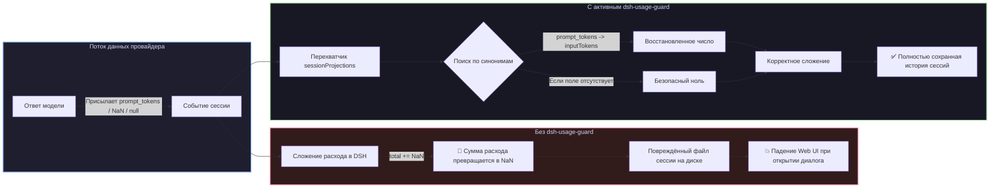

# 📦 @goodandready/dsh-usage-guard

<div align="center">

<h3>Защита истории сессий от повреждения битыми данными токенов (NaN), санитизация расхода и страховка арифметики для DeepSeek Harness</h3>

<p align="center">
  <a href="https://www.npmjs.com/package/@goodandready/dsh-usage-guard"></a>
  <a href="LICENSE"></a>
  <a href="https://github.com/topics/dsh-plugin"></a>
  <a href="https://nodejs.org"></a>
</p>

<p align="center">
  <a href="README.md"><b>🇬🇧 English</b></a> •
  <a href="README.ru.md"><b>🇷🇺 Русский</b></a> •
  <a href="README.zh.md"><b>🇨🇳 中文说明</b></a>
</p>

</div>

---

## ⚡ В чём проблема: как провайдеры ломают историю сессий

В ядре **DeepSeek Harness** подсчёт суммарного расхода токенов в сессиях складывается из четырёх счётчиков:
* `inputTokens`
* `outputTokens`
* `cacheReadTokens`
* `cacheWriteTokens`

Харнесс ожидает, что провайдер всегда присылает корректные конечные числа для `inputTokens` и `outputTokens`.

Однако нестандартные провайдеры, локальные движки инференса (vLLM, Ollama), кастомные роутеры и прокси часто отдают данные в ином формате:
* **Чужие имена полей**: `prompt_tokens`, `promptTokens`, `input`, `completion_tokens`, `output`, `cached_tokens`;
* **Пропущенные поля**: `undefined` или `null`;
* **Нечисловые значения**: `NaN`, `Infinity` или строки.

При сложении (`total += usage.inputTokens`) любое значение `NaN` или `undefined` превращает всю накопленную сумму в `NaN`. После сохранения файла на диск **вся история диалога становится нечитаемой и намертво роняет веб-интерфейс при повторном открытии**.



---

## 🛡️ Многоуровневая система восстановления

`dsh-usage-guard` перехватывает события службы `sessionProjections` до вызова арифметики и восстанавливает повреждённые данные:

### 1. Поиск по синонимам (`borrowed`)
Прежде чем подставлять ноль, плагин проверяет альтернативные названия полей:
* **`inputTokens`** ← `prompt_tokens`, `promptTokens`, `input`
* **`outputTokens`** ← `completion_tokens`, `completionTokens`, `output`
* **`cacheReadTokens`** ← `cache_read_tokens`, `cachedTokens`, `cached_tokens`, `cache_read_input_tokens`
* **`cacheWriteTokens`** ← `cache_write_tokens`, `cacheCreationTokens`, `cache_creation_input_tokens`

### 2. Проверка на конечное число (`sound`)
Проверка `typeof value === 'number' && Number.isFinite(value)` исключает `NaN`, `Infinity` и строки.

### 3. Безопасная подстановка нуля (`repaired`)
Если число найти не удалось, подставляется `0`. Это предотвращает порчу арифметики и сохраняет доступ к истории сессии.

### 4. Журналирование инцидентов (`complaint`)
При исправлении битой порции плагин логирует номер хода, шаг и способ исправления (взят по синониму или обнулён).

---

## 🔌 Безопасный перехват в памяти (`lib/patch.js`)

Плагин патчит реестр проекций `sessionProjections` без модификации исходных файлов ядра:
* **Существующие проекции**: оборачивает все уже зарегистрированные обработчики `.apply`.
* **Поздние проекции**: перехватывает будущие регистрации через хук `map.set`.
* **Нулевой оверхед**: поверхностное клонирование только по пути объекта расхода, все остальные ссылки остаются оригинальными.

---

## 📦 Быстрая установка

```bash
dsh plugin --profile web add @goodandready/dsh-usage-guard
```

---

## 📄 Лицензия

MIT © [GooDAnDReaDY](https://github.com/GooDAnDReaDY)
