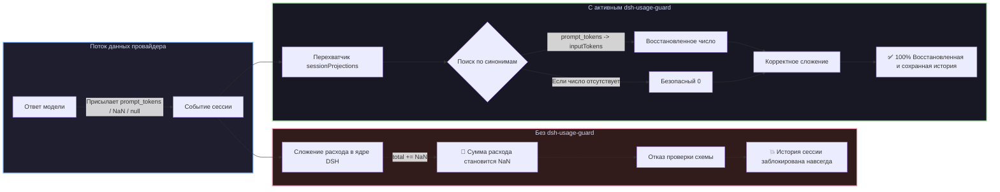

# 📦 @goodandready/dsh-usage-guard

<div align="center">

<h3>Защита истории сессий от повреждения битыми данными токенов (NaN), санитизация расхода и страховка арифметики для DeepSeek Harness</h3>

<p align="center">
  <a href="https://www.npmjs.com/package/@goodandready/dsh-usage-guard"></a>
  <a href="LICENSE"></a>
  <a href="https://github.com/topics/dsh-plugin"></a>
  <a href="https://nodejs.org"></a>
</p>

<p align="center">
  <a href="README.md"><b>🇬🇧 English</b></a> •
  <a href="README.ru.md"><b>🇷🇺 Русский</b></a> •
  <a href="README.zh.md"><b>🇨🇳 中文说明</b></a>
</p>

</div>

---

## ⚡ В чём суть проблемы: как провайдеры ломают историю сессий

В ядре **DeepSeek Harness** подсчёт суммарного расхода токенов складывается из четырёх счётчиков:

```javascript
uncachedInputTokens: usage.inputTokens,        // Без подстраховки в ядре DSH!
outputTokens:        usage.outputTokens,       // Без подстраховки в ядре DSH!
cacheReadTokens:     usage.cacheReadTokens ?? 0,
cacheWriteTokens:    usage.cacheWriteTokens ?? 0,
```

Поля кэша ядро подстраховывает через `?? 0`, а первые два берёт **как есть, без проверки на число**.

Когда сторонний провайдер, локальный движок инференса, шлюз или роутер присылает нестандартные названия полей, пустые значения или `NaN`, стандартное сложение (`total += usage.inputTokens`) превращает сумму расхода сессии в `NaN`.

После этого валидация схемы в ядре отвергает выжимку сессии:
```
history unavailable for session "<session-id>": expected number, received NaN
```

Поскольку история сессий в DSH рассчитывается на лету **путём повторного проигрывания журнала событий**, одна-единственная битая порция токенов навсегда блокирует открытие диалога в веб-интерфейсе.



---

## ✨ Ключевые возможности и механизмы защиты

### 1. Мгновенное восстановление ранее сломанных сессий
Плагин **не модифицирует** файлы журналов на диске. Он встаёт перед операцией сложения в памяти. Так как проигрывание сессий идёт через эту же точку, **все ранее повреждённые сессии начинают открываться снова сразу после установки плагина**.

### 2. Полный словарь синонимов полей (`borrowed`)
Прежде чем подставлять ноль, плагин ищет значения в общепринятых полях других API:

| Целевое поле DSH | Распознаваемые синонимы |
|---|---|
| `inputTokens` | `input_tokens`, `input`, `promptTokens`, `prompt_tokens` |
| `outputTokens` | `output_tokens`, `output`, `completionTokens`, `completion_tokens` |
| `cacheReadTokens` | `cache_read_tokens`, `cachedTokens`, `cached_tokens`, `cache_read_input_tokens` |
| `cacheWriteTokens` | `cache_write_tokens`, `cacheCreationTokens`, `cache_creation_input_tokens` |

### 3. Проверка на конечное число (`sound`)
Проверка `typeof value === 'number' && Number.isFinite(value)` гарантирует отсечение `NaN`, `Infinity`, `null`, `undefined` и строк.

### 4. Безопасная подстановка нуля (`repaired`)
Если число найти не удалось, подставляется `0`. Выбор делается в пользу приблизительного счёта вместо полностью заблокированной истории.

### 5. Безопасный перехват в памяти (`lib/patch.js`)
* **Существующие проекции**: оборачивает все методы `.apply` в `sessionProjections.registrations`.
* **Поздние проекции**: перехватывает будущие регистрации через хук `map.set`.
* **Комплексная защита**: защищает не только токены, но и формулы давления на контекст и разбор занятости.
* **Нулевой оверхед**: поверхностное клонирование применяется только к объекту расхода.

### 6. Дедуплицированное журналирование (`told`)
Выводит предупреждение с номером хода, шагом и способом починки (взят по синониму или обнулён). Одинаковые инциденты не спамят в лог при повторных проигрываниях.

---

## 📦 Быстрая установка

```bash
dsh plugin --profile web add @goodandready/dsh-usage-guard
```

---

## ⚙️ Параметры конфигурации (`settings.yaml`)

```yaml
dsh-usage-guard:
  repair: true
  report: true
```

| Параметр | Тип | По умолчанию | Описание |
|---|---|---|---|
| `repair` | `boolean` | `true` | Заменять пропущенные и нечисловые значения на ноль до сложения |
| `report` | `boolean` | `true` | Логировать информацию о поврежденных порциях в консоль |

---

## 📄 Лицензия

MIT © [GooDAnDReaDY](https://github.com/GooDAnDReaDY)
