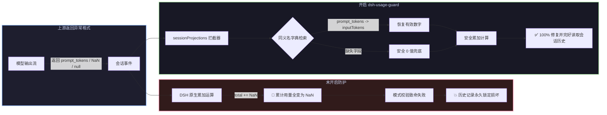

# 📦 @goodandready/dsh-usage-guard

<div align="center">

<h3>DeepSeek Harness 会话用量数据清洗、历史记录防崩与 Token 算术保护插件</h3>

<p align="center">
  <a href="https://www.npmjs.com/package/@goodandready/dsh-usage-guard"></a>
  <a href="LICENSE"></a>
  <a href="https://github.com/topics/dsh-plugin"></a>
  <a href="https://nodejs.org"></a>
</p>

<p align="center">
  <a href="https://goodandready.app/"></a>
</p>

<p align="center">
  <a href="README.md"><b>🇬🇧 English</b></a> •
  <a href="README.ru.md"><b>🇷🇺 Русский</b></a> •
  <a href="README.zh.md"><b>🇨🇳 中文说明</b></a>
</p>

<table align="center">
  <tr>
    <td align="center">
      ⭐ <strong>如果您喜欢这个插件，请在 GitHub 上为它点亮 Star</strong> — 这能让我知道插件对您有用，并鼓励我继续开发和维护它。
      <br><br>
      🐛 <strong>如果您发现 Bug 或希望增加功能</strong>，请使用任意语言在 GitHub 上提交 Issue — 我会评估您的建议，并在后续版本中实现有价值的改进。
    </td>
  </tr>
</table>

</div>

---

## ⚡ 核心痛点深度剖析：上游格式异常如何导致会话历史永久损坏

在 **DeepSeek Harness** 核心架构中，会话投影累加 4 类 Token 计数：

```javascript
uncachedInputTokens: usage.inputTokens,        // 核心源码无默认兜底保护！
outputTokens:        usage.outputTokens,       // 核心源码无默认兜底保护！
cacheReadTokens:     usage.cacheReadTokens ?? 0,
cacheWriteTokens:    usage.cacheWriteTokens ?? 0,
```

当第三方服务商、本地引擎或网关返回非标字段、空值或 `NaN` 时，累加逻辑 (`total += usage.inputTokens`) 会将累计用量污染为 `NaN`，导致架构模式校验致命拒绝：
```
history unavailable for session "<session-id>": expected number, received NaN
```

由于 DSH 历史记录是通过重放事件流动态计算生成的，**单个损坏的数据块会导致整个历史对话永久白屏且无法重新打开**。



---

## ✨ 核心亮点与保护机制

1. **已损坏历史记录免修文件即刻复活**：不修改磁盘日志，在内存重放链路拦截修复；
2. **主流别名字典智能提取 (`borrowed`)**：覆盖 `prompt_tokens`、`completion_tokens`、`cached_tokens`、`promptTokenCount`、`prompt_eval_count` 等；
3. **严格非负整数有效性校验 (`sound`)**：剔除 `NaN`、`Infinity`、负数错误码（如 `-1`）、非整数浮点数与非法字符串；
4. **安全 0 值兜底与浮点自动取整 (`repaired`)**：浮点数值与带小数数字字符串通过 `Math.round()` 转换为有效非负整数，彻底满足 Zod `z.number().int().nonnegative()` 模式校验；
5. **内存投影注册表动态切入与 WeakMap 高性能缓存 (`lib/patch.js`, `lib/index.js`)**：无缝覆盖全部 10–15 个并发投影，同一事件仅处理一次，其余投影 $O(1)$ 快速返回；
6. **防刷屏告警与 O(1) FIFO 内存保护 (`told`)**：容量上限为 1,000 项，达到上限时平滑淘汰最老记录，杜绝内存泄漏与误抑制；
7. **原生 Web UI 设置卡片 (`lib/client.js`)**：嵌入 DSH 原生设置中心（`settings.plugin.item`），实时状态徽章、3 秒自动消失保存提示与多语言支持。

---

## 🚀 v0.1.5 版本更新说明 (Changed in v0.1.5)

* **规范设置卡片插槽注册 (#3)**:
  彻底移除废弃的顶层侧边栏 `settings.section` 回退逻辑。严格遵循 DSH Plugin Authoring 规范，卡片仅注册至“设置 → 插件”标签页（`settings.plugin.item`），键名与命名空间一致为 `dsh-usage-guard`，不再占用全局侧边栏资源。
* **精简前端注册流**:
  客户端模块仅保留标准单一插槽注册，无任何额外回退延时。

## 🚀 v0.1.4 版本更新说明 (Changed in v0.1.4)

* **样式隔离标记 `data-dsh-plugin`**:
  动态 `<style>` 标签附加 `data-dsh-plugin="dsh-usage-guard"` 属性，避免被相邻插件的热重载清理机制误删。
* **修复插槽直接注册**:
  替换无效的 `ctx.slots.inject()` 调用为直接标准 `ctx.slots.register('settings.plugin.item', ...)`。
* **规范化单一英文字典**:
  客户端仅保留基础英语字典，翻译工作完全交由 DSH 核心翻译插件运行时接管。
* **安全配置初始化与全英文诊断**:
  `Config()` 初始化增加 `try...catch` 防护，控制台输出全面切换为标准英语日志。

## 🚀 v0.1.3 版本更新说明 (Changed in v0.1.3)

* **浮点与小数 Token 防崩保护 (Floats & Decimals)**：
  - DeepSeek Harness `@deepseek-ai/dsh-token-meter` 的投影模式严格要求整数 (`z.number().int().nonnegative()`)。部分路由网关返回的非整数计数（如 `42.5`）此前会导致 Zod 校验失败。
  - `sound()` 函数在 v0.1.3 中严格要求 `Number.isInteger(value)`。
  - 浮点数及带小数点的数字字符串通过 `Math.round()` 自动四舍五入为有效非负整数（`42.6` $\rightarrow$ `43`），确保会话历史永不白屏。
* **WeakMap 高性能事件缓存 (`guard`)**：
  - 会话重放时有 10–15 个并发投影同时调用拦截器。
  - 引入 `WeakMap<event, guardedEvent>` 微缓存：事件在首次调用时清洗并缓存，其余并发投影直接以 $O(1)$ 获取结果，消除重复克隆并杜绝内存泄漏。
* **日志告警缓存 FIFO 平滑淘汰 (`told`)**：
  - 将达到 1,000 条上限时的全量清空 `told.clear()` 改为 $O(1)$ 单条最旧数据淘汰 `told.delete(oldest)`，避免重新打开历史会话时日志重复刷屏。
* **Web UI 设置卡片交互体验与无障碍优化**：
  - 保存成功提示（"已保存"）支持 3 秒自动平滑淡出，且在修改任一复选框时立即重置。
  - 支持在无未提交草稿时平滑同步服务端后台配置。
  - 为表单项绑定 `id`/`htmlFor` 关联，并为折叠图标补充 `aria-hidden="true"` 无障碍属性。

---

## 🚀 v0.1.2 版本更新说明 (Changed in v0.1.2)

* **原生 Web UI 设置卡片 (`settings.plugin.item`)**：
  - 新增前端客户端模块 `lib/client.js`，在「设置 → 插件 → 插件设置」标签页注册原生卡片，绑定空间 `dsh-usage-guard`（Issue #2）。
  - 支持直接交互配置 `repair`（自动修复异常计数）与 `report`（记录诊断警告）。
  - 卡片头部支持实时状态徽章（开启时显示绿色 `ACTIVE`，仅审计时显示黄色 `REPORT ONLY`）。
  - 严格遵循 DSH 原生设计规范（CSS 变量、12px 圆角、核心折叠图标 `IconChevronDownOutline14`、无障碍 `aria-expanded`）。
  - 提供中、英、俄完整三语本地化支持（`zh` / `en` / `ru`）。
  - 内置 `settings.section` 降级容错机制。
* **设计契约**：
  - 补充 `docs/design/DESIGN.md`，符合 `project-design-contract` 和 `dsh-ui-design` 标准。

---

## 🚀 v0.1.1 版本更新说明 (Changed in v0.1.1)

* **负数穿透防护 (`nonnegative`)**：
  在 v0.1.0 中，部分代理网关返回的 `-1` 能通过有限数检测，进而导致 DSH 模式校验报错。v0.1.1 严格要求 `value >= 0`，负数将被识别为损坏并安全置 0。
* **数字字符串安全转换 (Stringified Numbers)**：
  部分上游返回的字符串数字（如 `inputTokens: "1540"`）在 v0.1.1 中将安全转换为真正数值，不再误重置为 0。
* **主流模型生态别名扩充**：
  - **Google Gemini API**：新增 `promptTokenCount`、`candidatesTokenCount`、`cachedContentTokenCount`。
  - **Ollama native API**：新增 `prompt_eval_count`、`eval_count`。
  - **OpenAI 缓存详情**：新增嵌套对象 `prompt_tokens_details.cached_tokens` 支持。
* **投影函数 `this` 上下文维持**：
  修复 `wrapApply` 调用时缺失 `this` 的问题，确保与对象方法式投影兼容。
* **日志防崩防护与跨会话隔离**：
  日志格式化引入 `try...catch` 兜底，防止循环引用导致服务崩溃；告警去重引入会话维度标记，杜绝跨会话误抑制。

---

## 📦 安装指南

```bash
dsh plugin --profile web add @goodandready/dsh-usage-guard
```

---

## ⚙️ 配置参考 (`settings.yaml` / Web UI)

```yaml
dsh-usage-guard:
  repair: true
  report: true
```

| 参数 | 类型 | 默认值 | 说明 |
|---|---|---|---|
| `repair` | `boolean` | `true` | 在累加前将缺失或非数值的 Token 计数替换为 0 |
| `report` | `boolean` | `true` | 接收到损坏用量样本时在日志输出警告信息 |

---

## 📄 开源协议

MIT © [GooDAnDReaDY](https://github.com/GooDAnDReaDY)