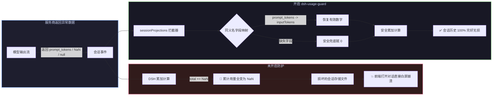

# 📦 @goodandready/dsh-usage-guard

<div align="center">

<h3>DeepSeek Harness 会话用量数据清洗、历史记录防崩与 Token 算术保护插件</h3>

<p align="center">
  <a href="https://www.npmjs.com/package/@goodandready/dsh-usage-guard"></a>
  <a href="LICENSE"></a>
  <a href="https://github.com/topics/dsh-plugin"></a>
  <a href="https://nodejs.org"></a>
</p>

<p align="center">
  <a href="README.md"><b>🇬🇧 English</b></a> •
  <a href="README.ru.md"><b>🇷🇺 Русский</b></a> •
  <a href="README.zh.md"><b>🇨🇳 中文说明</b></a>
</p>

</div>

---

## ⚡ 核心痛点：服务商异常格式如何导致会话历史崩溃

在 **DeepSeek Harness** 中，会话累加统计 4 种 Token 计数：
* `inputTokens`
* `outputTokens`
* `cacheReadTokens`
* `cacheWriteTokens`

当非标服务商或本地代理返回 `prompt_tokens`、`null` 或 `NaN` 时，核心累加逻辑 (`total += usage.inputTokens`) 会将累计用量污染为 `NaN`，导致落盘后的**历史对话记录在下次打开时彻底崩溃**。



---

## 🛡️ 多级清洗恢复体系

1. **同义名字段提取 (`borrowed`)**：智能映射 `prompt_tokens`、`completion_tokens`、`cached_tokens` 等数十种主流字段；
2. **有限数字有效性校验 (`sound`)**：严格过滤 `NaN`、`Infinity` 与字符串；
3. **安全 0 值兜底 (`repaired`)**：无法提取时安全填充 0，彻底阻断算术污染；
4. **内存无侵入拦截 (`lib/patch.js`)**：动态切入 `sessionProjections`，覆盖所有前置与后置投影。

---

## 📦 安装指南

```bash
dsh plugin --profile web add @goodandready/dsh-usage-guard
```

---

## 📄 开源协议

MIT © [GooDAnDReaDY](https://github.com/GooDAnDReaDY)
