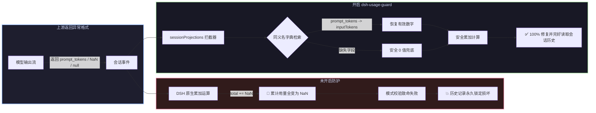

# 📦 @goodandready/dsh-usage-guard

<div align="center">

<h3>DeepSeek Harness 会话用量数据清洗、历史记录防崩与 Token 算术保护插件</h3>

<p align="center">
  <a href="https://www.npmjs.com/package/@goodandready/dsh-usage-guard"></a>
  <a href="LICENSE"></a>
  <a href="https://github.com/topics/dsh-plugin"></a>
  <a href="https://nodejs.org"></a>
</p>

<p align="center">
  <a href="https://goodandready.app/"></a>
</p>

<p align="center">
  <a href="README.md"><b>🇬🇧 English</b></a> •
  <a href="README.ru.md"><b>🇷🇺 Русский</b></a> •
  <a href="README.zh.md"><b>🇨🇳 中文说明</b></a>
</p>

</div>

---

## ⚡ 核心痛点深度剖析：上游格式异常如何导致会话历史永久损坏

在 **DeepSeek Harness** 核心架构中，会话投影累加 4 类 Token 计数：

```javascript
uncachedInputTokens: usage.inputTokens,        // 核心源码无默认兜底保护！
outputTokens:        usage.outputTokens,       // 核心源码无默认兜底保护！
cacheReadTokens:     usage.cacheReadTokens ?? 0,
cacheWriteTokens:    usage.cacheWriteTokens ?? 0,
```

当第三方服务商、本地引擎或网关返回非标字段、空值或 `NaN` 时，累加逻辑 (`total += usage.inputTokens`) 会将累计用量污染为 `NaN`，导致架构模式校验致命拒绝：
```
history unavailable for session "<session-id>": expected number, received NaN
```

由于 DSH 历史记录是通过重放事件流动态计算生成的，**单个损坏的数据块会导致整个历史对话永久白屏且无法重新打开**。



---

## ✨ 核心亮点与保护机制

1. **已损坏历史记录免修文件即刻复活**：不修改磁盘日志，在内存重放链路拦截修复；
2. **主流别名字典智能提取 (`borrowed`)**：覆盖 `prompt_tokens`、`completion_tokens`、`cached_tokens`、`promptTokenCount`、`prompt_eval_count` 等；
3. **非负有限数字安全性校验 (`sound`)**：剔除 `NaN`、`Infinity`、负数错误码（如 `-1`）与非法格式；
4. **安全 0 值兜底 (`repaired`)**：彻底阻断算术污染；
5. **内存投影注册表动态切入 (`lib/patch.js`)**：无缝覆盖前置与后置投影，完整保留 `this` 上下文；
6. **防刷屏告警与内存保护 (`told`)**：集成会话识别与容量上限（1,000 项），杜绝内存泄漏与误抑制。

---

## 🚀 v0.1.1 版本更新说明 (Changed in v0.1.1)

* **负数穿透防护 (`nonnegative`)**：
  在 v0.1.0 中，部分代理网关返回的 `-1` 能通过有限数检测，进而导致 DSH 模式校验报错。v0.1.1 严格要求 `value >= 0`，负数将被识别为损坏并安全置 0。
* **数字字符串安全转换 (Stringified Numbers)**：
  部分上游返回的字符串数字（如 `inputTokens: "1540"`）在 v0.1.1 中将安全转换为真正数值，不再误重置为 0。
* **主流模型生态别名扩充**：
  - **Google Gemini API**：新增 `promptTokenCount`、`candidatesTokenCount`、`cachedContentTokenCount`。
  - **Ollama native API**：新增 `prompt_eval_count`、`eval_count`。
  - **OpenAI 缓存详情**：新增嵌套对象 `prompt_tokens_details.cached_tokens` 支持。
* **投影函数 `this` 上下文维持**：
  修复 `wrapApply` 调用时缺失 `this` 的问题，确保与对象方法式投影兼容。
* **日志防崩防护与跨会话隔离**：
  日志格式化引入 `try...catch` 兜底，防止循环引用导致服务崩溃；告警去重引入会话维度标记，杜绝跨会话误抑制。

---

## 📦 安装指南

```bash
dsh plugin --profile web add @goodandready/dsh-usage-guard
```

---

## 📄 开源协议

MIT © [GooDAnDReaDY](https://github.com/GooDAnDReaDY)